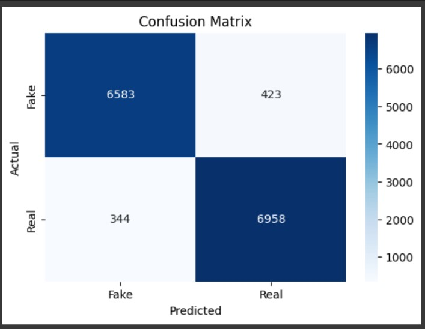

<h1 align="center">📰 Fake News Detection using Logistic Regression</h1>

<p align="center">
A binary text classification machine learning project that detects whether a news article is real or fake using Natural Language Processing (NLP) techniques and Logistic Regression.
</p>
<p align="center">
  
  
  
  
</p>

---

## 🧠 Problem Statement

Given a dataset of real and fake news articles, build a model that can classify new/unseen news as either **real** or **fake** based on its textual content.

---

## 📊 Dataset Details

* **Source:** [`WELFake_Dataset.csv`](https://www.kaggle.com/datasets/mdnurhossen/welfake-dataset)
* **Download Link:** [WELFake Dataset on Kaggle](https://www.kaggle.com/datasets/mdnurhossen/welfake-dataset)
* **Columns Used:** `title`, `text`, `label`
* **Target Label:**
  * `1` = Real news
  * `0` = Fake news
* **Final Input Feature:** Combined `title` and `text` into a single text field before preprocessing

---

## 🚀 Project Workflow

1. **Import Dependencies**
2. **Load Dataset** (`WELFake_Dataset.csv`)
3. **Preprocess Data**

   * Remove nulls
   * Combine text columns
   * Clean text with regex
   * Remove stopwords & apply stemming
4. **Feature Engineering**

   * TF-IDF Vectorization using unigrams & bigrams
5. **Train-Test Split**

   * Stratified 80/20 split
6. **Model Training**

   * Compared Logistic Regression, Naive Bayes, and Random Forest
   * Selected **Logistic Regression** for best balance of speed and performance
7. **Model Evaluation**

   * Accuracy, Precision, Recall, F1-score
   * Confusion Matrix (visualized with seaborn)
8. **Save Model & Vectorizer** using `pickle`
9. **Custom Prediction**

   * In-notebook prediction function

---

## 📈 Model Performance

| Metric   | Training Set | Test Set   |
| -------- | ------------ | ---------- |
| Accuracy | **95.86%**   | **94.64%** |
| F1-score | 0.96         | 0.95       |

### 🔍 Confusion Matrix Heatmap (Test Set)

<p align="center">
  
</p>

✔️ Indicates strong generalization with balanced performance on both classes.

---

## 🧪 Example Usage

```python
Enter: "Breaking: President gives major update on national policy."
Output: "Prediction for custom news input: Real "
```

---

## 📦 Installation & Setup

```bash
git clone https://github.com/Toshaksha/fake_news_detection.git
cd fake_news_detection
pip install -r requirements.txt
```

---

## 🗂 Project Structure

```
fake-news-detection/
│
├── fake_news_prediction.ipynb            # Jupyter notebook (model training)
├── requirements.txt                      # Python dependencies
├── models/
│   ├── logistic_regression_model.pkl     # Saved ML model
│   └── tfidf_vectorizer.pkl              # Saved TF-IDF vectorizer
├── images/
│   └── confusion_matrix.jpg              # Confusion matrix heatmap
└── README.md                             # Project documentation
```

---

## 🧰 Tools & Libraries Used

* Python 3.x
* **NLTK** – for stopwords and stemming
* **Scikit-learn** – ML models and metrics
* **Pandas**, **NumPy** – data handling
* **Seaborn**, **Matplotlib** – visualization
* **tqdm** – progress bar for processing

---

## 👤 Author

**Toshaksha** – [GitHub Profile](https://github.com/Toshaksha)

---

⭐ *If you found this project helpful, please give it a star on GitHub!*

